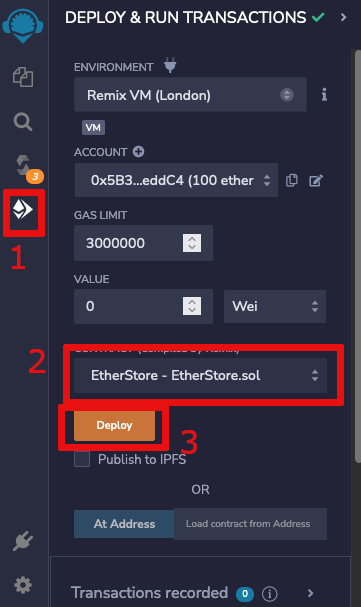
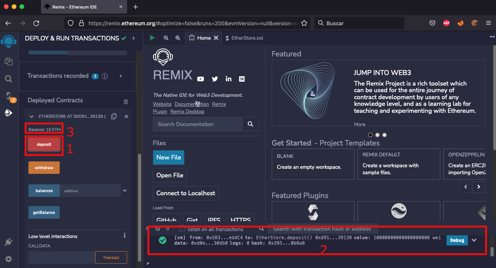

# Last Christmas I gave you my ETH - Day8

Este año por cuarta ocasión la plataforma [TryHackme](https://tryhackme.com/room/adventofcyber4) realizo su evento anual denominado Advent of Cyber, un room (reto) con diversas temáticas que tienen por cada uno de los días antes de llegar a navidad, a parte del conocimiento adquirido en estos retos de diversas aéreas de tecnología que van desde la ciberseguridad, smart contracts, forensia digital, blue team, read team, etc. Además que regalan varios premios de manera al azar entre los que desarrollan los retos.

Para dar un poco de contexto la narrativa trata de la navidad los elfos de Santa decidieron seguir la moda sobre blockchain y criptomonedas, resultando en la creación de un Smart Contract  el cual fue comprometido y perdieron todos sus criptomonedas debido al ataque. 

La vulnerabilidad sufrida es una falla común en en los contractos inteligentes denominada **Reentrancy Attacks**

Ahora vamos a realizar un repaso de algunos conceptos relacionados pero no profundizaremos en los mismo:

1. **Criptografía:** El propósito del cifrado es transformar los datos para mantenerlos en secreto de los demás, como ejemplo si deseamos enviar a alguien una carta secreta que solo él debe poder leer, o enviar una contraseña de forma segura a través de Internet. En lugar de centrarse en la usabilidad, el objetivo es garantizar que los datos no puedan ser consumidos por nadie más que por los destinatarios previstos.

   El cifrado transforma los datos en otro formato de tal manera que solo las personas específicas pueden revertir la transformación. Utiliza una clave, que se mantiene en secreto, junto con el texto sin formato y el algoritmo, para realizar la operación de cifrado. Como tal, se requiere el texto cifrado, el algoritmo y la clave para volver al texto sin formato. Los cifrados más comunes son los cifrados simétricos y los asimétricos.

2. **Hashing:**  tiene el propósito de garantizar la integridad, es decir, hacer que si algo cambia, usted pueda saber que ha cambiado. Técnicamente, el hashing toma entradas arbitrarias y produce una cadena de longitud fija que tiene los siguientes atributos:

   * La misma entrada siempre producirá la misma salida.
   * Múltiples entradas dispares no deberían producir la misma salida.
   * No debería ser posible pasar de la salida a la entrada.
   * Cualquier modificación de una entrada dada debería resultar en un cambio drástico en el hash.

   Hashing se utiliza junto con la autenticación para producir pruebas sólidas de que un mensaje determinado no se ha modificado. Esto se logra tomando una entrada determinada, haciéndola hash y luego firmando el hash con la clave privada del remitente.

3. **Blockchain**: una cadena de bloques es una base de datos digital o un ledger distribuido entre los nodos de una red de igual a igual (Peer-to-peer). La cadena de bloques se distribuye entre "pares" o miembros sin servidores centrales, por lo tanto, "descentralizada". Debido a su naturaleza descentralizada, se espera que cada par mantenga la integridad de la cadena de bloques. Si un miembro de la red intentara modificar una cadena de bloques maliciosamente, otros miembros la compararían con su cadena de bloques para verificar su integridad y determinarían si toda la red debería expresar ese cambio.

4. Smart Contracts: La mayoría de las aplicaciones prácticas de blockchain se basan en una tecnología conocida como contrato inteligente. Los contratos inteligentes se usan más comúnmente como la columna vertebral de las aplicaciones DeFi (aplicaciones de finanzas descentralizadas) para respaldar una criptomoneda en una cadena de bloques. Las aplicaciones DeFi facilitan el intercambio de divisas entre entidades; un contrato inteligente define los detalles del intercambio. Un contrato inteligente es un programa almacenado en una cadena de bloques que se ejecuta cuando se cumplen condiciones predeterminadas, de igual manera que cualquier otra aplicación estos se desarrollan utilizando diversos lenguajes de programación como pueden ser Vyper, Yul, rust o hasta JavaScript.

##### Background

En la siguiente imagen observamos se explica como se realizo el Ataque a un DAO (Decentralized autonomous organization)

Fuente: https://quantstamp.com/blog/what-is-a-re-entrancy-attack

Un ejemplo de un Reentry process puede ser el envío de un correo electrónico. Un usuario puede comenzar a escribir un correo electrónico con su cliente favorito, guardar un borrador, enviar otro correo electrónico y terminar el mensaje más tarde. Este es un ejemplo inofensivo. Sin embargo, imagine un sistema bancario en línea mal construido para emitir transferencias electrónicas donde el saldo de la cuenta se verifica solo en el paso de inicialización. Un usuario podría iniciar varias transferencias sin enviar ninguna de ellas. El sistema bancario confirmaría que la cuenta del usuario tiene un saldo suficiente para cada transferencia individual. Si no hubo verificación adicional en el momento del envío real, el usuario podría enviar todas las transacciones y potencialmente exceder el saldo de su cuenta. Este es el mecanismo principal del exploit de reingreso que se usó en el conocido hackeo de DAO.

##### Desarrollo del Ataque Reentry Attack

1. ###### Requerimientos: 

   * Utilizaremos la herramienta  online **https://remix.ethereum.org/**
   * Los archivos del reto en este repositorio.

2. ###### Paso a paso 

   Descomprimir los archivos, encontraremos dos con extensión **.sol**

Accedemos al navegador con el IDE https://remix.ethereum.org/

Vamos a importar los dos archivos arriba listados **EtherStore.sol** y **Attack.sol**

Deberán aparecernos los archivos del reto

Debemos compilar los contratos, para ello vamos **solidity compiler ** y seleccionar **0.8.10+commitfcxxxxxx** de la lista desplegable del menu compiler. Podemos ignorar las adevertencias

Debemos tener seleccionado los archivos para poder compilar el contracto

Se nos desplegara la opción del contrato ya compilado

Repetimos la acción para el archivo **EtherStore.sol** 

Continuamos con el despliegue del contrato, vamos a la sección o pestaña **deployment tab**

En la imagen anterior el punto2 seleccionamos el contrato y luego se hace el deploy, nos aparecerá en la sección de deployment contracts lo siguiente

Procederemos a realizar un deposito de ether para comprobar que el mismo este funcionando correctamente, seleccionamos la cuenta de donde realizaremos el deposito y la cantidad que vamos a depositar demás de la criptomoneda

Luego procedemos a presionar deposit y debemos ver en los logs del contrato la transferencia y luego aparecerá en nuestro estatus de balance actualizado

Vamos a desplegar el contrato que usaremos para el ataque, cambiaremos la cuenta de prueba, pero debemos apuntar la cuenta inicial del contrato **0xd9145CCE52D386f254917e481eB44e9943F39138** antes de cambiarla

Cambiamos la cuenta

Nos debe quedar la cuenta que seccionamos y copiamos la dirección **0xAb8483F64d9C6d1EcF9b849Ae677dD3315835cb2**

Vamos a desplegar el contrato y colocamos la dirección copiada inicialmente, la del contrato **EtherStore.sol** y la colocamos a continuación

Observamos los dos contratos desplegados

Vamos a realizar el ataque, colocamos el valor de lo que vamos a robar de la cuenta incial  (**0xd9145CCE52D386f254917e481eB44e9943F39138** - saldo 10 eth) a la cuenta de ataque (**0xAb8483F64d9C6d1EcF9b849Ae677dD3315835cb2** - saldo 99.999 eth)  el valor colocado debe ser menor al total del contrato EtherStore.sol

Procedemos a realizar el robo desde el contrato de ataque, en la referencia debemos colocar el valor del contrato **EtherStore.sol**

Debe verse reflejado lo que se esta robando del contrato, en el balance, aquí tengo más de lo que mostraba pero fue por hacer varias pruebas

Debemos obtener la flag en la consola, como pueden ver se presiono en varias ocasiones.

##### Prevención

El ataque de reingreso en el contrato DAO podría haberse evitado de varias maneras. El uso de las funciones send() o transfer() en lugar de call.value() no permitiría llamadas de retiro recurrentes debido al bajo gasto de gas. Limitar manualmente la cantidad de gas que pasa a call.value() lograría el mismo resultado.

Existe una mejor práctica que hace imposible cualquier ataque de reingreso. Si el contrato DAO actualiza el saldo del usuario antes de la transferencia de ether, cualquier intento de llamada de retirada recursiva transferirá un saldo de 0 ether. Este principio se aplica generalmente: si no se realizan actualizaciones de estado interno después de una transferencia de ether o una llamada de función externa dentro de un método, el método está protegido contra la vulnerabilidad de reingreso.

##### Conclusiones

Este tipo de desafíos permite aprender de manera divertida, sobre diversos tópicos, en este caso un ataque a los famosos smart contracts, pero podemos observar que las fallas encontradas son siempre similares a las de la web 2.0, es cuestión de tener esa sed de conocimiento y ganas de seguir aprendiendo, es muy recomendable esta plataforma y  estaremos desarrollando nuevos retos.  

##### Referencias

* Miessler, D. (2020, 16 septiembre). Hashing vs. Encryption vs. Encoding vs. Obfuscation. Daniel Miessler. https://danielmiessler.com/study/encoding-encryption-hashing-obfuscation/
* C 353: Reentrancy Attack (25 pts). (s. f.). https://samsclass.info/141/proj/C353.htm
* What is a Re-Entrancy Attack? (s. f.). https://quantstamp.com/blog/what-is-a-re-entrancy-attack

